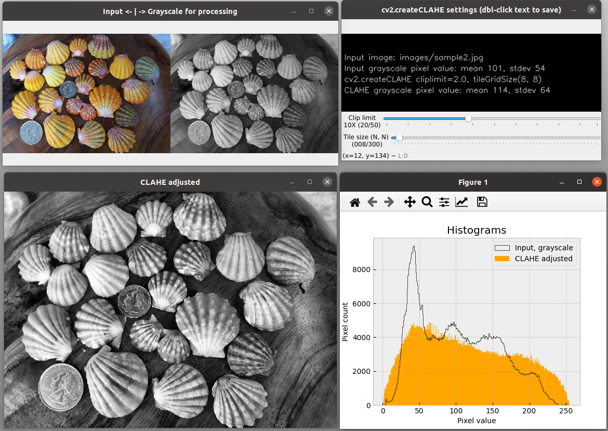

# Project: opencv-contour-util
A set of Python utilities to easily explore OpenCV parameters involved in drawing contours for object detection. A variety of parameter values can be adjusted with OpenCV trackbars (see figures below). Live image updates are displayed in multiple windows for each processing step leading to object detection and sizing. 

A utility is also provided to explore parameters for automatic histogram equalization.

All processing steps are conducted on grayscale representations of the input file. A text file of selected settings and the resulting image file of sized contours overlaid on the original color or monochrome image can be saved. Image file samples are provided in the `images` folder.

Project inspired by code from Adrian Rosebrock:
https://pyimagesearch.com/2016/03/28/measuring-size-of-objects-in-an-image-with-opencv/

The intention is to help OpenCV users understand the pertinent parameters and value ranges needed to identify objects.

Development environment was Linux Ubuntu 20.04 with PyQt5 API. Has been tested in macOS 13.2 and Windows10 for basic functionality, but window formatting on those platforms still needs work.

## edge_it.py
The module `edge_it.py` uses Canny edge detection, cv2.Canny, as the basis to identify contours.
## thresh_it.py
The module `thresh_it.py` uses thresholding, cv2.threshold, as the basis to identify contours.
## shape_it.py
The module `shape_it.py`, also uses thresholding, but adds detection of specific shapes with the functions cv2.approxPolyDP() for polygons and cv2.HoughCircles() for circles. Shape detection works with the threshold contour trackbar set. Using the `sample4.jpg` file for input provides a good example of parameter settings needed to detect different shapes. For example, starting with `sample4.jpg` and default settings, circle shapes ("Shape" trackbar position #11), are identified only if the "Threshold type" trackbar is set to use Triangle ( position #1) instead of the default Otsu (position 0).
## equalize_it.py
The module `equalize_it.py` does not involve contours, but explores parameters for automatic histogram equalization as an optional pre-processing step for object detections. Equalization is done with cv2.createCLAHE. CLAHE is a contrast-limited adaptive histogram equalization method. Live updates of the CLAHE histogram are controlled by slide bars for the clipLimit and tileGridSize parameter values. All processing is carried out on a grayscale version of the input file. The grayscale equalized image can be saved to use as input for `thresh_it.py` or `equalize_it.py`. For most contour operations, however, the contrast and brightness controls provided in the these two modules should be sufficient.

Be aware that CLAHE works best on images that have a full range of pixel values across the image, as in sample2.jpg (shells). In other words, it does not work well with images that have large areas of similar colors, as in sample1.jpg (pills), sample3.jpg (rummikub), or sample4.jgp (shapes). Nonetheless, this module can be fun to play with. Live histogram updating may be less responsive with larger image files.
 
Slightly more responsive versions for updating histograms with trackbars are `equalize_tk.py` for Linux systems and `equalize_qt.py` for all systems. `equalize_tk.py` uses a tkinter GUI. `equalize_qt.py` uses a PyQt5 GUI, which may require installation: `pip3 install -U pyqt5`. If `equalize_it.py` does not show histograms plots on your system, try one of the other equalize* programs. 

A known issue is that, while `equalize_it.py` should work on all systems, some Linux installations may not show histograms. If that's the case, then try `equalize_tk.py` or `equalize_qt.py`. The problem may be with the specific version of the required python packages.

### Usage examples:
From within the program's folder, use one of these Terminal or Command Prompt command formats, depending on your system. Note that with no input argument, as in the first example, the default sample1.jpg from the `images` folder is used for input. Three sample input files are provided in the `images` folder.

       python3 -m edge_it

       python3 -m thresh_it --input images/sample2.jpg

       python3 -m equalize_it -i images/sample2.jpg

List command line options: `python3 -m thresh_it --help`
       
       Explore Image Processing Parameters.
       optional arguments:
         -h, --help            show this help message and exit
         --about               Provide description, version, GNU license
         --input PATH/FILE, -i PATH/FILE
                               Path to input image (PNG or JPG file).

Basic information, author, version, license, etc.: `python3 -m thresh_it --about`

 All windows, except for Settings, can be dragged to resize.
 
The Esc or Q key will quit any running module (except if "Histograms" window in `equalize_it.py` is currently selected; then just select one of the other windows to use a Quit key). From the command line, the usual Ctrl-C will also exit a module.

Sample image files are provided in the `images` folder:
* sample1.jpg (pills, 800x600 692 kB),
* sample2.jpg (shells, 1050x750, 438 kB),
* sample3.jpg (rummikub, 4032x3024, 2.94 MB)

### Requirements:
Python 3.7 or later, plus the packages OpenCV Matplotlib, Pandas, Numpy, and tkinter (included with 3.7 and above).
This program was developed in Python 3.8.

For quick installation of the required Python PIP packages:
from the downloaded GitHub repository folder, run this command

    pip install -r requirements.txt
Alternative commands (system dependent):

    python3 -m pip install -r requirements.txt (recommended for all systems)
    py -m pip install -r requirements.txt (Windows)

### Known Issues:
In macOS 13 and Windows10, proper scaling of windows is not automatic. All windows will need to be manually resized to have a useful program. Any ideas for configuring window management are welcome.

### Screenshots:

Opening windows for `thresh_it.py` with the `sample3.jpg` input file.

All available threshold parameters.

Expanded window for identified threshold objects and their comparative pixel sizes with default `thresh_it.py` settings. Input file is `sample3.jpg`.

Histograms and CLAHE windows will live update with CLAHE parameter sliders.

### Attributions
Source of sample1.jpg image file:
Adrian Rosebrock at https://pyimagesearch.com/2016/03/28/measuring-size-of-objects-in-an-image-with-opencv/

Source of sample2.jpg image file:
http://sunrisekauai.blogspot.com/2012/06/new-group-of-sunrise-shells.html

Source of other image files:
author, C.S. Echt
